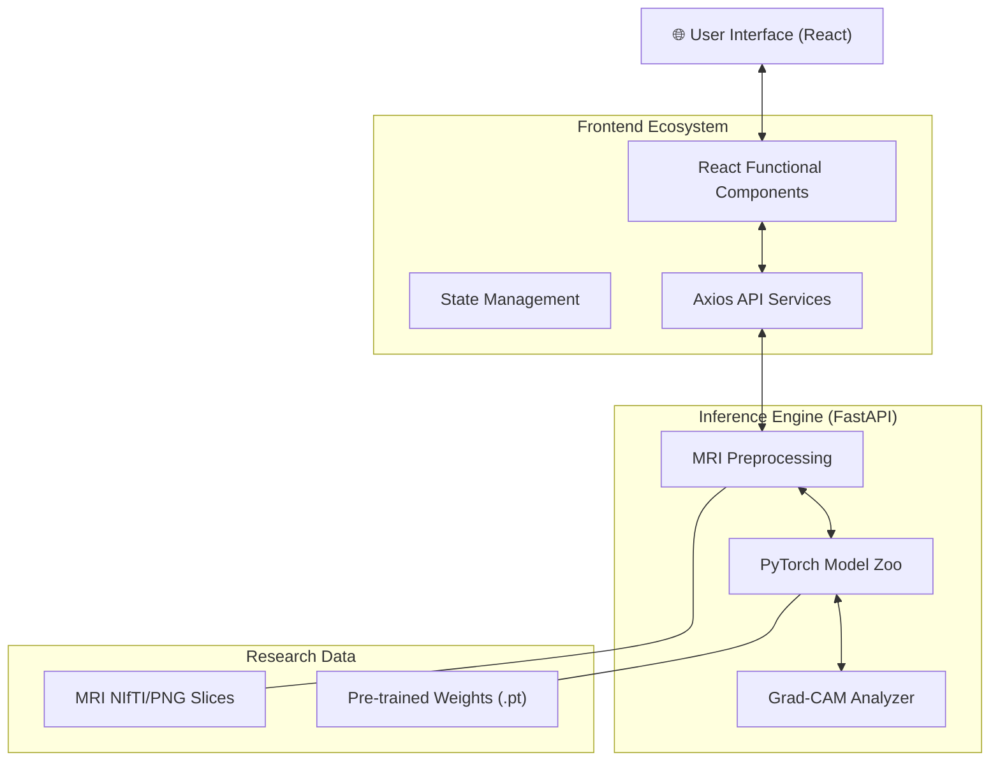
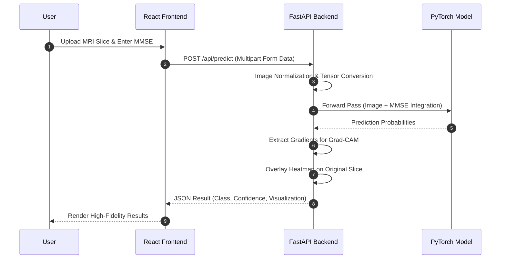
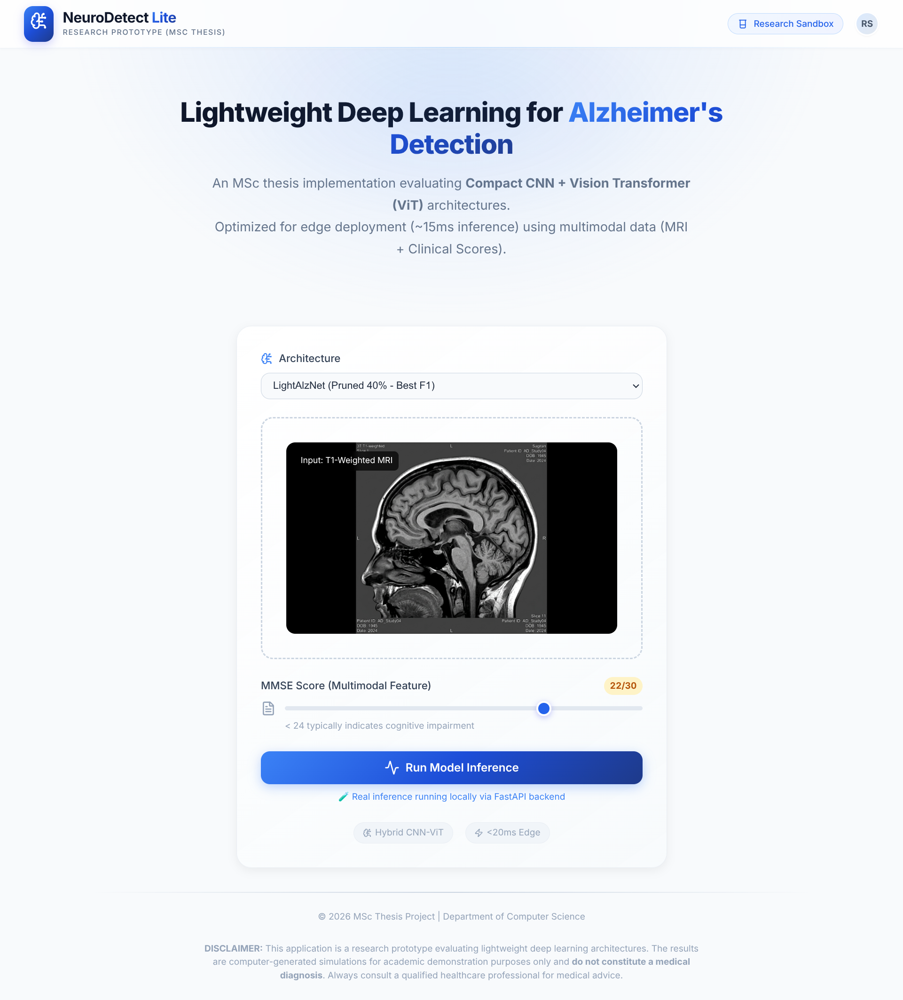
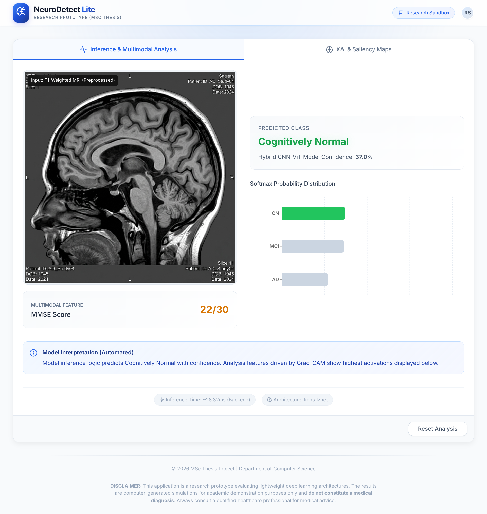
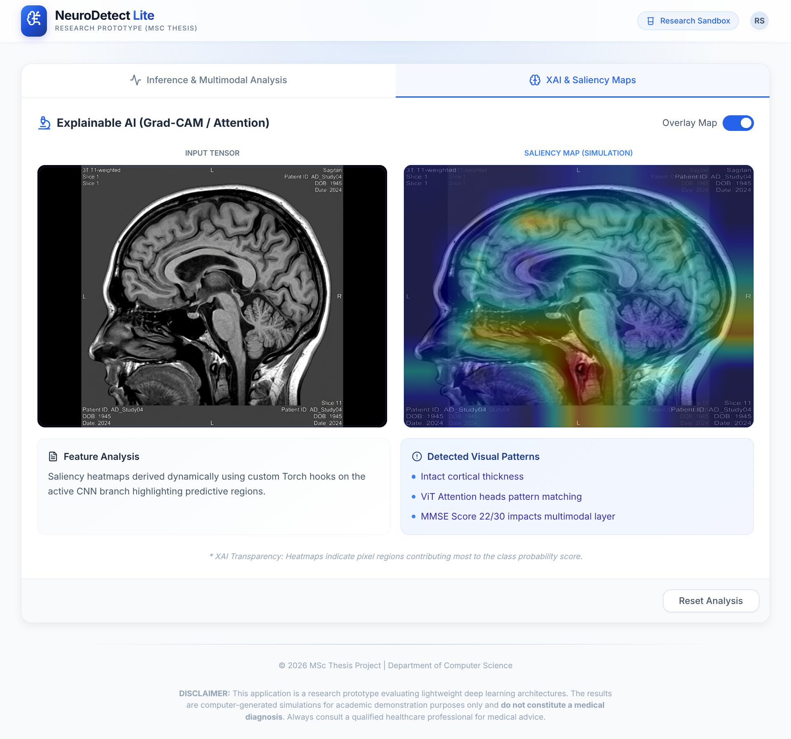

# NeuroDetect Lite 🧠

[](https://fastapi.tiangolo.com/)
[](https://reactjs.org/)
[](https://pytorch.org/)
[](https://www.typescriptlang.org/)
[](https://tailwindcss.com/)

> **NeuroDetect Lite** is an advanced, lightweight neuroimaging analysis pipeline designed for real-time Alzheimer's Disease classification. By combining deep learning with clinical metrics (MMSE), it provides interpretable diagnostic insights through Grad-CAM visualizations.

---

## 🏗️ System Architecture

NeuroDetect Lite employs a modular full-stack architecture designed for research scalability and clinical deployment.



---

## 🧪 Inference Pipeline

The diagnostic flow integrates raw imaging data with patient cognitive scores (MMSE) to produce a comprehensive classification.



---

## 🖼️ System Gallery

| Diagnosis View | Gradient Analysis | Comparison |
|:---:|:---:|:---:|
|  |  |  |

---

## 🚀 Key Features

- **Multi-Modal Integration**: Combines MRI structural data with clinical MMSE scoring.
- **Explainable AI (XAI)**: Native Grad-CAM support for localized neuropathology visualization.
- **Accessible Design**: Built following the **Accessible & Ethical** UI/UX pattern with high contrast and WCAG-compliant components.
- **Lightweight Deployment**: Optimized for edge inference with minimal hardware overhead.

---

## 🛠️ Installation & Setup

### 1. Backend (FastAPI)
```bash
cd back-end
# Create and activate virtual environment
python -m venv venv
source venv/bin/activate  # On Windows: venv\Scripts\activate
# Install dependencies
pip install -r requirements.txt
# Run the server
python main.py
```

### 2. Frontend (React + Vite)
```bash
cd front-end
# Install dependencies
npm install
# Configure environment variables
cp .env.example .env.local
# Run developer server
npm run dev
```

---

## 📄 Research & Citation

This project is part of a research initiative detailed in the paper:
**"NeuroDetect Lite: Lightweight Deep Learning for Alzheimer's Classification"** (2026).

If you use this work in your research, please cite:
```bibtex
@article{neurodetect2026,
  title={NeuroDetect Lite: Lightweight Deep Learning for Alzheimer's Classification},
  author={Alzheimer's Model Pipeline Team},
  year={2026},
  journal={Internal Research Repository}
}
```

---

## 📜 License

Distributed under the MIT License. See `LICENSE` for more information.
